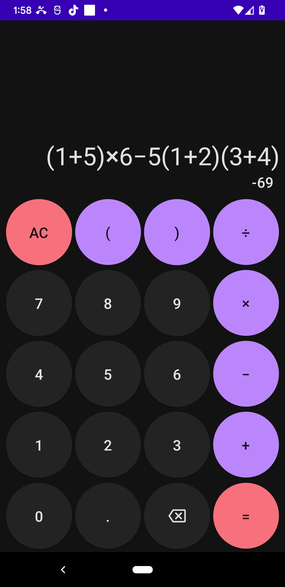
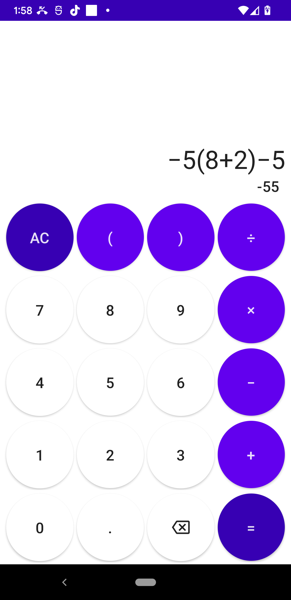

# simple-calc

Just a simple calculator written in Kotlin w/ Jetpack Compose for Android.
It supports light and dark modes, as well as landscape and portrait on any screen size.  
It also respects order of operations!
 

  
  

